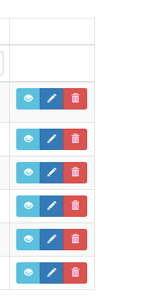
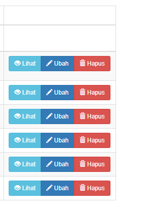
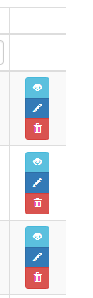
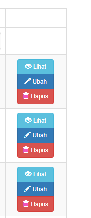

ActionColumn Button Group
=========================
ActionColumn with Button Group Style of Bootstrap

Installation
------------

The preferred way to install this extension is through [composer](http://getcomposer.org/download/).

Either run

```
php composer.phar require --prefer-dist dickyermawan/yii2-actioncolumn-btngroup "*"
```

or add

```
"dickyermawan/yii2-actioncolumn-btngroup": "*"
```

to the require section of your `composer.json` file.


Usage
-----

Once the extension is installed, simply use it in your code by  :

```
// some code in GridView columns

[
    'class' => 'dickyermawan\ActionColumn\BtnGroup',
    'type' => 'vertical',
    'label' => ['Lihat', 'Ubah', 'Hapus']
],

```
### Note: type and label are optional. try it yourself to know


Screenshots<br />



